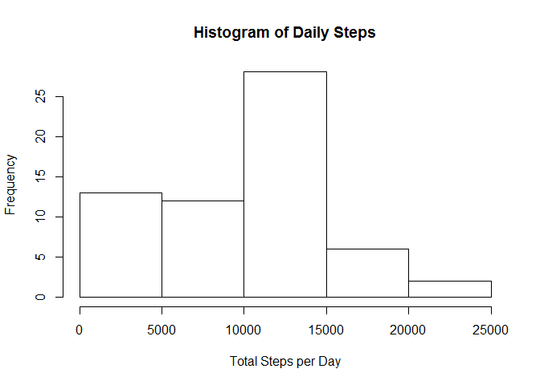
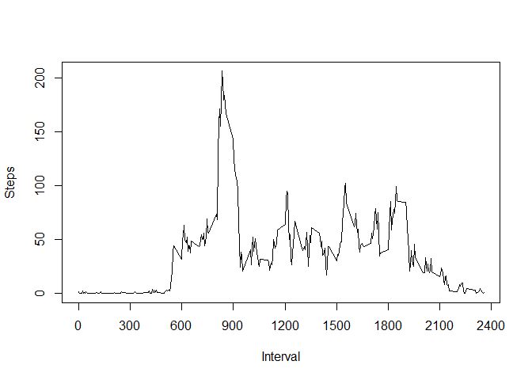

# Reproducible Research: Peer Assessment 1

## Loading and preprocessing the data

Make sure the `data.table` package is loaded and then load the raw data from `activity.csv`  


```r
require(data.table)||install.packages(data.table)
actData<-data.table(read.csv("activity.csv"))
```

## What is mean total number of steps taken per day?


*1.  Calculate the total number of steps taken per day*  

This is grouped together in dailyData, which is actData grouped by date

```r
dailyData<-actData[, list(steps=sum(steps, na.rm=TRUE)), by=date]
```

*2.  If you do not understand the difference between a histogram and a barplot, research the difference between them. Make a histogram of the total number of steps taken each day*

The histogram of total steps per day is below:


```r
hist(dailyData$steps, main="Histogram of Daily Steps", xlab="Total Steps per Day")
```

 


*3.  Calculate and report the mean and median of the total number of steps taken per day*


```r
mean(dailyData$steps)
```

Mean steps per day are: 9354.2295082


```r
median(dailyData$steps)
```

Median steps per day are: 10395


## What is the average daily activity pattern?

*1. Make a time series plot (i.e. type = "l") of the 5-minute interval (x-axis) and the average number of steps taken, averaged across all days (y-axis)*

Time series plot is below:  

```r
intervalData<-actData[, list(steps=mean(steps, na.rm=TRUE)), by=interval]
plot(intervalData$steps ~ intervalData$interval, type="l", xlab="Interval", ylab="Steps", xaxt="n")
axis(side=1, at=seq(from=0, to=2400, by=300))
```

 

*2. Which 5-minute interval, on average across all the days in the dataset, contains the maximum number of steps?*
On average, the 5 minute interval can be found by:

```r
intervalData[intervalData[,intervalData$steps==max(intervalData$steps)]]
```

```
##    interval    steps
## 1:      835 206.1698
```

## Imputing missing values
*Note that there are a number of days/intervals where there are missing values (coded as `NA`). The presence of missing days may introduce bias into some calculations or summaries of the data.*

*1. Calculate and report the total number of missing values in the dataset (i.e. the total number of rows with `NAs`)*


```r
completes<-complete.cases(actData)
sum(!completes)
```

```
## [1] 2304
```


*2. Devise a strategy for filling in all of the missing values in the dataset. The strategy does not need to be sophisticated. For example, you could use the mean/median for that day, or the mean for that 5-minute interval, etc.*

*3. Create a new dataset that is equal to the original dataset but with the missing data filled in.*

*4. Make a histogram of the total number of steps taken each day and Calculate and report the mean and median total number of steps taken per day. Do these values differ from the estimates from the first part of the assignment? What is the impact of imputing missing data on the estimates of the total daily number of steps?*


## Are there differences in activity patterns between weekdays and weekends?
